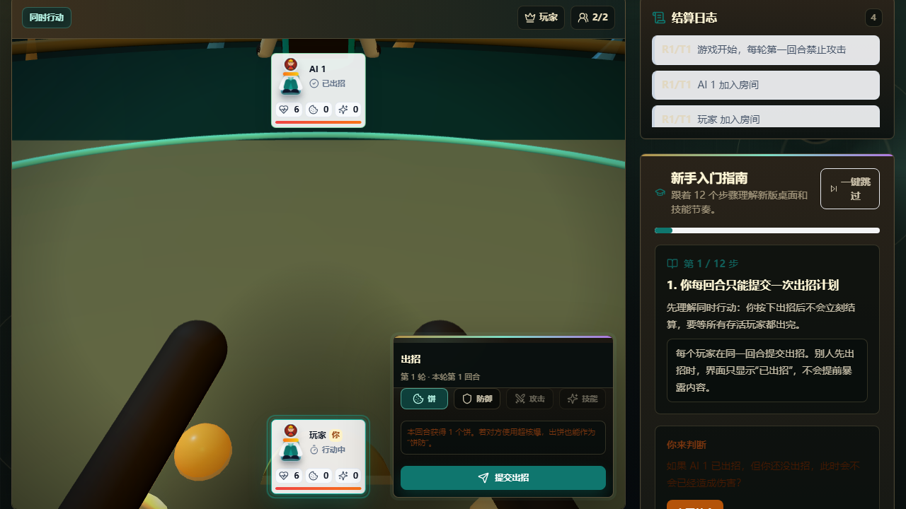
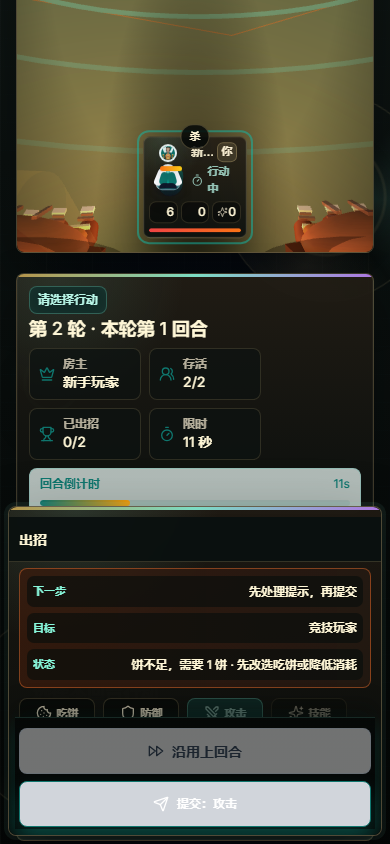

# BING Game / 饼

<p align="center">
  <strong>一款同步出招、资源博弈、技能连锁、支持复盘与 3D 牌桌的多人卡牌策略游戏。</strong>
</p>

<p align="center">
  <a href="#快速开始">快速开始</a>
  ·
  <a href="#公网联机">公网联机</a>
  ·
  <a href="docs/UI_DESIGN_PLAN.md">UI 设计方案</a>
  ·
  <a href="workflow/prompts/prompt-goal-combos.md">提示词 + Goal</a>
  ·
  <a href="docs/ARCHITECTURE.md">架构说明</a>
  ·
  <a href="docs/AI_TRAINING.md">AI 训练</a>
</p>

<p align="center">
  
  
  
  
  
  
  
</p>

<p align="center">
  
</p>

## 项目状态

| 项目 | 当前状态 |
| --- | --- |
| 可玩性 | 双玩家创建房间、加入房间、开始、出招、沿用上回合、攻击和结算 happy path 已通过 UI agent；复杂技能 smoke 已覆盖火箭双目标。 |
| UI / HUD | 3D 牌桌、行动 HUD、底部命令区、目标预览、结算摘要和移动端 LOD 已落地。 |
| 自动化验收 | `test:ui-agents`、`test:ui-agents:complex` 和 `test:character-browser` 会先刷新 client dist，再运行浏览器 playtest。 |
| 最新报告 | `artifacts/playtests/ui-agents-2026-06-13T21-00-22-591Z/report.md` |
| 复杂技能报告 | `artifacts/playtests/ui-agents-2026-06-13T20-56-42-947Z/report.md` |
| 发布口径 | 可用于受控公网试玩；正式公开发布前仍需许可证、资产权属、复杂技能浏览器门禁和备份策略。 |

## 项目简介

`饼` 是一个原创回合制卡牌策略游戏。它的核心不是轮流操作，而是所有玩家在同一回合暗中提交行动，然后由服务端统一亮招并结算：吃饼、防御、攻击、反弹、破弹、释放技能，最后看谁能在牌桌上活下来。

当前项目已经包含：

- Socket.IO 实时房间：创建房间、加入房间、观战、准备、提交行动、广播结算结果。
- 前后端共用的 TypeScript 规则包：动作、攻击、技能、状态机和 socket 类型保持一致。
- React 游戏客户端：3D 牌桌、玩家座位、技能特效、行动面板、结算日志、新手教程和复盘入口。
- 比赛记录与复盘：服务端保存对局，支持复盘页面、文本报告和训练样本导出。
- 公网联机脚本：通过 Cloudflare Tunnel 临时生成 HTTPS 地址，让不同网络的玩家直接加入。
- Playtest agents：自动开房、双玩家出招、复杂技能 smoke、截图、检查 canvas、遮挡、目标预览、行动 HUD、底部命令区和沿用上回合。
- 本地角色资产：6 个默认角色已有 Blender blockout、LOD0/LOD1 skinned/animated GLB、portrait、mobile-avatar、turnaround、table-scale、rig-guide、动作剪影和材质审计。

## 截图

<p align="center">
  
</p>

## 体验亮点

| 亮点 | 说明 |
| --- | --- |
| 同步出招 | 玩家同时暗中提交行动，服务端统一亮招结算，避免传统轮流制的等待感。 |
| 饼资源博弈 | 吃饼、消耗、反弹、防御和高费技能互相牵制，适合 2-6 人局。 |
| 游戏 HUD | 行动面板显示“下一步 / 目标 / 状态”，底部固定“沿用上回合 / 提交”。 |
| 战斗表现层 | BattleDirector 输出 beat、目标、hit-stop、VFX 和 camera cue，驱动桌面反馈。 |
| 自动 playtest | 两个玩家 agent、开发商/QA agent 和美术总监视角会真实开房、出招、截图并生成 Markdown 报告。 |

## 快速开始

```bash
npm install
npm run dev
```

本地开发地址：

- 前端：[http://localhost:5173](http://localhost:5173)
- 后端：[http://localhost:3001](http://localhost:3001)

## 公网联机

如果要临时开一个公网多人房间：

```bash
npm run public
```

这个命令会构建项目、启动生产服务，并用 Cloudflare Tunnel 把本机 `3001` 端口暴露为一个临时 HTTPS 地址。游玩期间请保持终端窗口打开。

如果已经构建过，可以跳过构建：

```bash
npm run public:no-build
```

长期部署建议使用云服务器或平台服务：

```bash
npm install
npm run build
npm run serve
```

更多说明见 [docs/PUBLIC_PLAY.md](docs/PUBLIC_PLAY.md) 和 [docs/DEPLOYMENT.md](docs/DEPLOYMENT.md)。

## 常用命令

| 命令 | 用途 |
| --- | --- |
| `npm run dev` | 同时启动前端和后端开发服务。 |
| `npm run build` | 构建 shared、server 和 client。 |
| `npm run serve` | 启动生产模式服务。 |
| `npm run public` | 构建、启动服务并打开临时公网隧道。 |
| `npm run typecheck` | 对所有 workspace 运行 TypeScript 检查。 |
| `npm run test:ci` | 运行 typecheck、角色资产审计、规则回归和 turn timeline 检查。 |
| `npm run verify` | 构建项目并运行核心检查与 UI agents。 |
| `npm run verify:release` | 构建并运行发布前完整门禁：CI、发布资产审计、默认 UI、复杂技能和角色浏览器。 |
| `npm run test:assets` | 检查 6 个角色的 GLB、头像、QA 图和 PBR 贴图资源。 |
| `npm run test:release-assets` | 检查 public 静态资源中没有 Blender 源文件或角色 source 目录。 |
| `npm run test:character-browser` | 先构建 client，再逐个创建角色房间，用真实浏览器验证 animated GLB 加载和 3D canvas。 |
| `npm run test:rules` | 运行规则回归测试。 |
| `npm run test:turn-timeline` | 检查事件日志到动画 beat 的映射。 |
| `npm run test:ui-agents` | 先构建 client，再启动双玩家 UI agent，生成截图和 Markdown 报告。 |
| `npm run test:ui-agents:complex` | 先构建 client，再运行单房主 + AI 对手的复杂技能 smoke。 |
| `npm run import:skills` | 从技能表导入技能数据。 |
| `npm run training:export` | 导出比赛训练数据。 |
| `npm run training:selfplay` | 运行自博弈训练脚本。 |

## 当前进度

- 桌面端已接入 LOD0 animated GLB 角色展示；加载失败时会回退到程序化 3D 角色。
- 6 个默认角色已具备 `idle / attack / defend / skill / hit / down` 动作剪影 QA 图。
- 逐角色浏览器验收已覆盖 6 个默认角色的选择、房间状态、animated GLB 请求和 3D canvas 采样。
- 初版 BattleDirector 已统一结算 cue、牌桌 metadata 和 3D 镜头脉冲。
- UI agent 已覆盖双玩家 3 回合 happy path 和复杂技能 smoke，并检查 canvas、GLB 加载、目标预览、行动 HUD、底部命令区、遮挡、console error 和失败动作。
- 角色仍是 WIP/blockout 口径：尚未完成最终高模、授权资产声明、精细权重绘制和精修运行时动画。
- 下一阶段重点是竞技读局层、复杂技能参数抽屉、断线重连/多人集火 playtest、6 角色 runtime 精修和更完整的平衡测试。

## 项目结构

```text
apps/
  client/          React、Vite、Tailwind、Three.js 游戏界面
  server/          Express、Socket.IO、房间状态、复盘接口
packages/
  shared/          共享规则、动作、技能、socket 类型、状态机
docs/              架构、部署、公网联机、AI 训练、UI 设计方案
scripts/           技能导入、公网隧道、规则检查、训练工具
tools/             Blender/MCP 辅助脚本，本地大文件已忽略
workflow/          任务模板、评审模板、制作流程文档
```

## 核心玩法流程

1. 创建或加入房间。
2. 选择角色/头像，并由房主配置房间规则。
3. 每位玩家在同一回合提交一个隐藏行动。
4. 服务端统一亮招并结算所有行动。
5. 牌桌播放反馈：亮招、伤害、防御、反弹、技能、死亡和轮次变化。
6. 对局结束后可以查看复盘，并导出结构化训练数据。

## 设计方向

当前 UI 已经有 3D 桌面、玩家座位、行动面板和右侧信息栏。下一步目标是把它从“可玩的原型”推进到“像正式游戏一样清楚、有反馈、有节奏”的体验：

- 当前玩家是否需要操作必须一眼可见。
- 服务端每个关键事件都应对应一个明确的视觉动画节拍。
- 3D 桌面要有沉浸感，但不能牺牲卡牌和状态信息的可读性。
- 引入两个玩家 agent、一个开发商/QA agent、一个美术总监 agent，持续生成测试反馈和修改清单。
- 角色资产遵循 `workflow/docs/01-visual-bible.md`，先以 blockout 验证轮廓，再推进半写实细化。

完整方案见 [docs/UI_DESIGN_PLAN.md](docs/UI_DESIGN_PLAN.md)。

## 文档入口

- [架构说明](docs/ARCHITECTURE.md)
- [部署说明](docs/DEPLOYMENT.md)
- [发布清单](docs/RELEASE_CHECKLIST.md)
- [公网联机](docs/PUBLIC_PLAY.md)
- [异网联机](docs/remote-play.md)
- [AI 训练](docs/AI_TRAINING.md)
- [UI 设计方案](docs/UI_DESIGN_PLAN.md)
- [Playtest 子智能体报告](docs/PLAYTEST_REPORT.md)
- [产品计划](docs/PRODUCT_PLAN.md)
- [子智能体 UI 评审](docs/SUBAGENT_UI_REVIEW.md)
- [美术总监 Blender 方案](docs/SUBAGENT_ART_DIRECTOR_BLENDER.md)
- [角色资产审计](docs/CHARACTER_ASSET_AUDIT.md)
- [提示词 + Goal 组合写法](workflow/prompts/prompt-goal-combos.md)
- [Game Pillars](workflow/docs/00-game-pillars.md)
- [Visual Bible](workflow/docs/01-visual-bible.md)

## 许可证

当前为私有项目。公开发布或接受外部贡献前，请先补充许可证。
