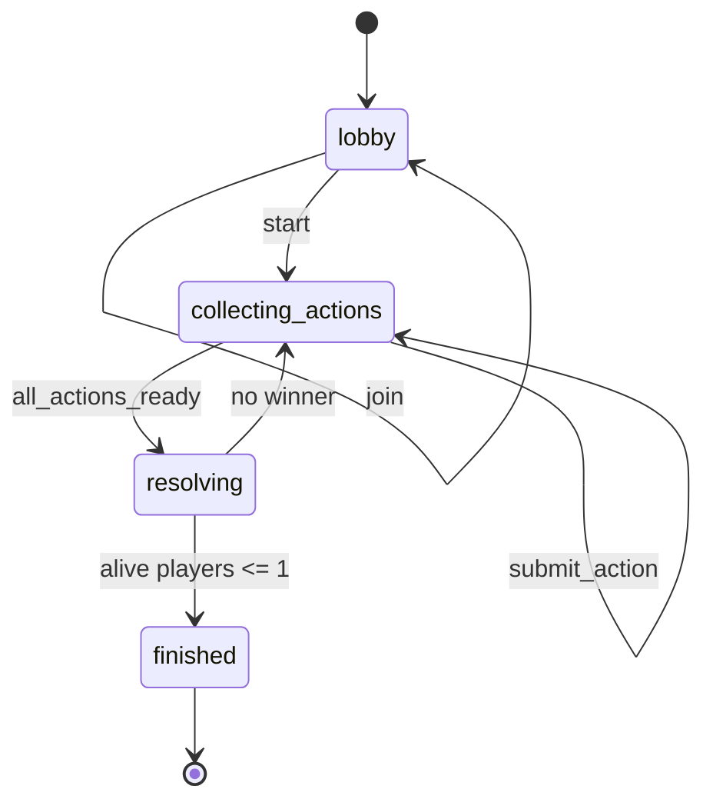
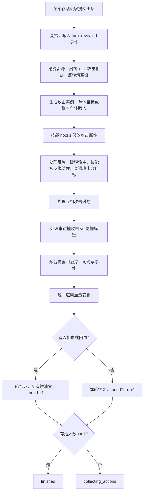

# 《饼》架构设计

## 1. 项目目录结构

```text
bing-card-game/
  apps/
    client/                 # React + TypeScript + Tailwind 前端
      src/
        components/         # 对局 UI、出招面板、日志
        lib/                # Socket 与格式化工具
    server/                 # Node.js + Express + Socket.IO 后端
      src/
        ai.ts               # AI 玩家策略入口
        roomStore.ts        # 内存房间与游戏状态管理
        index.ts            # HTTP/Socket 网关
  packages/
    shared/                 # 前后端共享强类型规则包
      src/
        engine/             # 基础攻击、校验、结算引擎
        skills/             # 技能注册表与 Excel 导入技能库
        state/              # 状态机
        replay/             # Replay 事件导出
        socket.ts           # Socket 通信契约
        types.ts            # 核心类型
  scripts/
    import-skills.py        # 从根目录 xlsx 导入技能表
  docs/
    ARCHITECTURE.md
```

## 2. 核心 TypeScript 类型定义

核心类型在 `packages/shared/src/types.ts`，前后端共用，避免协议漂移。

```ts
export type GamePhase = "lobby" | "collecting_actions" | "resolving" | "finished";
export type DefenseKind = "small" | "youtiao" | "stone" | "rebound";
export type DefenseTag = "small" | "youtiao" | "stone" | "any" | "cake" | "unblockable";

export interface PlayerState {
  id: PlayerId;
  name: string;
  kind: "human" | "ai";
  hp: number;
  cakes: number;
  status: "alive" | "dead";
  connected: boolean;
  skills: SkillId[];
  buffs: BuffState[];
}

export type PlayerAction =
  | { type: "gain_cake" }
  | { type: "defense"; defense: DefenseKind; targetId?: PlayerId }
  | { type: "attack"; attackId: AttackId; stacks: number; targetId?: PlayerId }
  | { type: "skill"; skillId: SkillId; stacks: number; targetId?: PlayerId };

export interface GameState {
  id: GameId;
  phase: GamePhase;
  roundNumber: number;
  roundTurnNumber: number;
  turnNumber: number;
  players: PlayerState[];
  pendingActions: Partial<Record<PlayerId, PlayerAction>>;
  eventLog: GameEvent[];
  winnerIds: PlayerId[];
  config: GameConfig;
  createdAt: number;
  updatedAt: number;
}
```

基础攻击定义在 `packages/shared/src/engine/attacks.ts`，叠加时按规则同步放大消耗、攻击力、等级。擒的基础等级是 0，所以叠加后仍然是 0。

## 3. 回合状态机



状态机代码在 `packages/shared/src/state/machine.ts`。

## 4. 结算流程图



结算主入口是 `submitPlayerAction` 与 `resolveTurn`，位于 `packages/shared/src/engine/resolver.ts`。

## 5. Socket 通信设计

通信契约在 `packages/shared/src/socket.ts`。

| 方向 | 事件 | 作用 |
| --- | --- | --- |
| Client -> Server | `room:create` | 创建房间并绑定当前 socket 的玩家身份 |
| Client -> Server | `room:join` | 加入房间 |
| Client -> Server | `room:add_ai` | 在 lobby 加入 AI 玩家 |
| Client -> Server | `game:start` | 从 lobby 进入收招阶段 |
| Client -> Server | `game:submit_action` | 提交本回合出招 |
| Server -> Client | `room:state` | 广播公开游戏状态，只暴露已提交玩家 id，不泄露未亮出的动作 |
| Server -> Client | `room:error` | 推送错误 |

## 6. 技能系统扩展方案

Excel 技能表已通过 `scripts/import-skills.py` 导入为 `RAW_SKILL_CATALOG`。当前每条技能都有稳定 id、名称、融合方法、描述、标签和来源行号。

技能通过 hooks 接入结算流程：

```ts
export interface SkillHooks {
  validateAction?: (context: SkillContext, action: PlayerAction) => ValidationResult;
  modifyAttack?: (context: SkillContext, attack: AttackStats) => AttackStats;
  beforeDamage?: (context: SkillContext, damage: number, sourceId?: PlayerId) => number;
  afterTurnResolved?: (context: SkillContext) => GameState;
}
```

已经示范接入了两个锁定技：

- `火焰刀`：杀攻 2、等级 2、变火系。
- `朱雀羽扇`：擒攻 4、等级 1、变火系。

未来扩展点：

- AI 玩家：`apps/server/src/ai.ts` 替换为策略树、蒙特卡洛或模型决策。
- 王者卡：作为特殊 `SkillDefinition.category = "king_card"`，通过 hooks 注册主动/被动效果。
- Buff/Debuff：`PlayerState.buffs` 已在状态内预留，可由技能 hooks 增删。
- Replay：所有结算都写入 `GameEvent`，`packages/shared/src/replay/events.ts` 可导出事件帧。
- 天梯：后端 `RoomStore` 可替换成数据库仓储，结算后基于 `GameFinishedEvent` 写排名。

## 7. 示例代码

提交动作后，如果所有存活玩家都已提交，服务端立即调用共享结算引擎。

```ts
const result = submitPlayerAction(state, playerId, action);
rooms.set(roomId, result.state);
```

前端不自行判定胜负或伤害，只提交强类型动作。

```ts
socket.emit("game:submit_action", {
  roomId,
  action: {
    type: "attack",
    attackId: "sha",
    stacks: 2,
    targetId
  }
});
```
